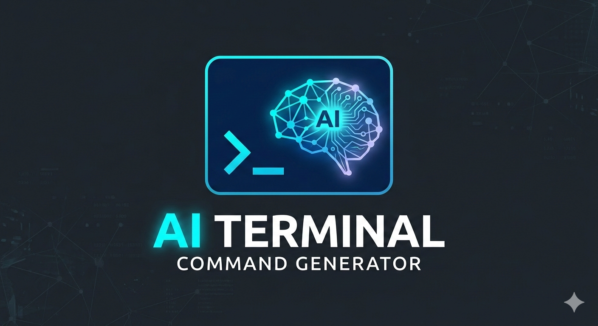

<p align="center">
  
</p>

# AIT (AI Terminal)

**AI-powered terminal command generator** — describe what you want in plain English, get the shell command instantly.

```bash
ait "find all PDF files modified in the last 7 days"
# Output: find . -name "*.pdf" -mtime -7
```

> **Module 2 Project** for the [LLM Engineering & Deployment](https://readytensor.ai) certification program by Ready Tensor.
>
> See the full [publication on Ready Tensor](https://app.readytensor.ai/publications/ait-ait-terminal-soybnfL7xMUl) for deployment details and cost analysis.

---

## Features

- **Simple CLI** — Just run `ait "your description"` and get a command
- **Auto-Detect OS** — Automatically generates commands for your current platform
- **Target Any OS** — Use `-t win`, `-t linux`, or `-t mac` to generate for other platforms
- **Headless Mode** — `ait generate "..."` for scripting and piping
- **OpenAI-Compatible** — Works with OpenAI, LiteLLM, Ollama, and any compatible endpoint
- **Cross-Platform** — Linux, macOS, and Windows support
- **Secure** — API tokens masked in output, config files with restricted permissions
- **Custom Model Support** — Uses a fine-tuned Qwen3 model for terminal commands

---

## Architecture

```
┌─────────────┐     ┌─────────────────────────────────────────────┐
│   AIT CLI   │────▶│  LiteLLM Proxy (HuggingFace Spaces)         │
│  (Go binary)│     │  ┌─────────────┐    ┌────────────────────┐  │
└─────────────┘     │  │  LiteLLM    │───▶│  HF Endpoint Proxy │  │
                    │  │  (port 7860)│    │  (port 8000)       │  │
                    │  └─────────────┘    └─────────┬──────────┘  │
                    └───────────────────────────────┼─────────────┘
                                                    │
                    ┌───────────────────────────────▼─────────────┐
                    │  HuggingFace Dedicated Inference Endpoint   │
                    │  (Qwen3-0.6B Terminal Instruct)             │
                    └─────────────────────────────────────────────┘
```

---

## Installation

### Option 1: Go Install (Recommended)

If you have Go 1.21+ installed:

```bash
go install github.com/Eng-Elias/ait@latest
```

This installs `ait` to your `$GOPATH/bin` (usually `~/go/bin`).

### Option 2: Download Binary

Download the latest release for your platform from the [Releases](https://github.com/Eng-Elias/ait/releases) page:

| Platform       | Binary                  |
|----------------|-------------------------|
| Linux (AMD64)  | `ait-linux-amd64`       |
| Linux (ARM64)  | `ait-linux-arm64`       |
| macOS (Intel)  | `ait-darwin-amd64`      |
| macOS (Apple)  | `ait-darwin-arm64`      |
| Windows        | `ait-windows-amd64.exe` |

### Option 3: Build from Source

```bash
git clone https://github.com/Eng-Elias/ait.git
cd ait
make build
```

### Install System-Wide

```bash
make install
```

This copies the binary to `/usr/local/bin` (Unix) or `%PROGRAMFILES%` (Windows).

---

## Quick Start

### 1. Run Setup

```bash
ait setup
```

You will be prompted for:
- **API Endpoint** (default: OpenAI)
- **API Token** (your OpenAI API key)
- **Model** (default: `gpt-4o-mini`)

The wizard will test your connection and save the configuration.

### 2. Generate a Command

```bash
ait "list all files larger than 100MB"
```

AIT will:
1. Send your description to the AI
2. Display the generated command
3. Ask for confirmation (`Y/n`)
4. Execute the command if you confirm

---

## Usage

### Basic Usage

```bash
# Auto-detects your OS and generates the right command
ait "show disk usage sorted by size"

# Target a specific OS
ait "find all log files" -t linux
ait "list running processes" -t mac
ait "check open ports" -t win
```

### Target OS Flag (`-t`)

| Flag Value       | Target         | Shell      |
|------------------|----------------|------------|
| `win`, `windows` | Windows        | PowerShell |
| `linux`          | Linux          | bash       |
| `mac`, `macos`   | macOS          | zsh        |
| *(omitted)*      | Auto-detected  | Auto       |

### Headless Mode

```bash
ait generate "list all docker containers"
# Output: docker ps -a
```

Generates a command and prints it to stdout without confirmation. Useful for scripting:

```bash
$(ait generate "count lines in all Python files")
```

### Configuration

```bash
# Show current config
ait config

# Get a specific value
ait config get model

# Set a value
ait config set model default

# Run setup wizard again
ait setup
```

### Version

```bash
ait version
```

---

## Troubleshooting

### "AI not configured"

Run `ait setup` to configure your API credentials.

### "Authentication failed"

Your API token is invalid or expired. Update it:

```bash
ait config set api_token sk-your-new-token
```

### "API request failed"

- Check your internet connection
- Verify the API endpoint is correct: `ait config get api_endpoint`
- For local endpoints (LiteLLM, Ollama), ensure the server is running

### "Rate limit exceeded"

Wait a moment and try again. Consider upgrading your API plan for higher limits.

### Debug Mode

Enable debug logging for troubleshooting:

```bash
ait "your prompt" --debug
```

Logs are written to `~/.ait/debug.log`.

---

## Deployment

AIT uses a LiteLLM proxy deployed on HuggingFace Spaces to route requests to a fine-tuned Qwen3 model.

### Deployed Infrastructure

| Component | Platform | Description |
|-----------|----------|-------------|
| LiteLLM Proxy | HuggingFace Spaces | API gateway with auth, rate limiting |
| HF Endpoint Proxy | Same Space (supervisord) | Translates OpenAI format to TGI native |
| Model Endpoint | HF Dedicated Inference | Qwen3-0.6B Terminal Instruct |
| Database | Supabase | Virtual keys, usage tracking |

### Deploy Your Own

See [`deploy/litellm/hf-spaces/README.md`](deploy/litellm/hf-spaces/README.md) for deployment instructions.

---

## Development

```bash
make build          # Build for current platform
make build-all      # Cross-compile for all platforms
make test           # Run tests
```

Requires Go 1.21+.

---

## Links

- **GitHub**: [github.com/Eng-Elias/ait](https://github.com/Eng-Elias/ait)
- **Fine-Tuned Model**: [huggingface.co/Eng-Elias/Qwen3-0.6B-terminal-instruct](https://huggingface.co/Eng-Elias/Qwen3-0.6B-terminal-instruct)
- **LiteLLM Proxy**: [eng-elias-litellm.hf.space](https://eng-elias-litellm.hf.space)
- **Module 1 Project**: [Fine-Tuning Qwen3 for Terminal Commands](https://app.readytensor.ai/publications/fine-tuning-qwen3-06b-for-cross-platform-terminal-command-generation-lnWR43YpgJaH)

---

## License

MIT License — see [LICENSE](LICENSE) for details.
